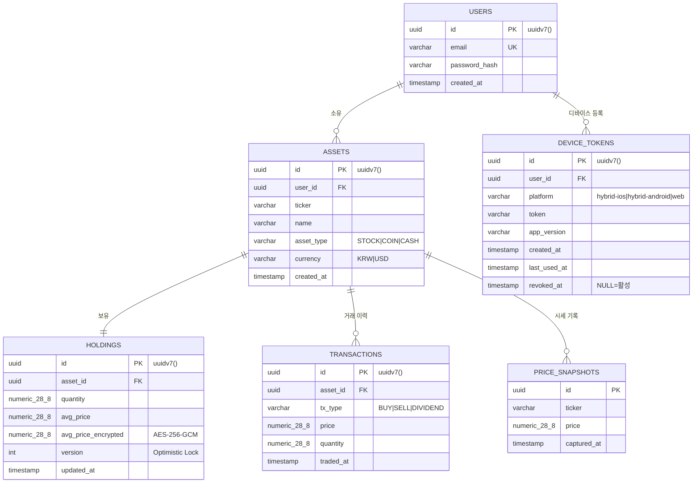
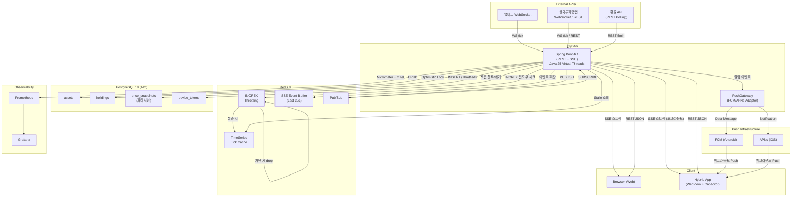
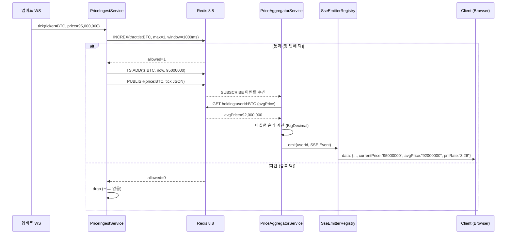

# AllFolio — Product Requirements Document (PRD)

**버전:** 1.1.0  
**최종 수정:** 2026-08-05  
**작성자:** JEONGHWANLEE  
**상태:** Draft (개발 착수 전)

---

## 목차

1. [Project Overview & Objectives](#1-project-overview--objectives)
2. [Problem Statement & Solution](#2-problem-statement--solution)
3. [User Stories & Personas](#3-user-stories--personas)
4. [Tech Stack](#4-tech-stack)
5. [Functional Requirements](#5-functional-requirements)
6. [Non-Functional Requirements](#6-non-functional-requirements)
   - 6.9 [Operations & SLO](#69-operations--slo)
7. [Data Model & Entity Draft](#7-data-model--entity-draft)
8. [Core API Spec Outline](#8-core-api-spec-outline)
9. [Technical KPIs & Success Metrics](#9-technical-kpis--success-metrics)
   - 9.4 [Product KPIs](#94-product-kpis)
10. [Appendix](#10-appendix)

---

## 1. Project Overview & Objectives

### 1.1 프로젝트 정의

**AllFolio**는 주식, 코인, 현금 등 분산된 자산을 하나의 화면에서 실시간으로 통합 조회하고, 추가 매수(물타기) 시나리오를 In-Memory에서 즉시 계산하며, 실시간 시세 차트 위에 개인 평단가를 SSE(Server-Sent Events)로 스트리밍하는 **백엔드 중심 포트폴리오 프로젝트**다. 웹 브라우저 및 **WebView 기반 하이브리드 모바일 앱(Capacitor)** 클라이언트를 동시에 지원하는 **API-First** 백엔드로 설계된다.

### 1.2 백엔드 기술 목표

이 프로젝트는 단순 CRUD를 넘어 **금융 도메인에서 발생하는 세 가지 핵심 백엔드 과제**를 해결하는 것을 목표로 한다.

| 목표 | 구체적 도전 과제 | 기술적 해결 수단 |
|---|---|---|
| **금융 정밀도** | `double` 부동소수 오차로 인한 평단가/비중 계산 오류 | `BigDecimal` + `NUMERIC(28,8)` 전면 적용 |
| **실시간 처리** | 초당 수백 건 외부 시세 틱을 DB 부하 없이 클라이언트까지 전달 | Redis In-Memory + Throttling + SSE 스트리밍 |
| **대용량 동시성** | 1,000개 이상 SSE 커넥션을 스레드 폭발 없이 유지 | Java 25 Virtual Threads |
| **하이브리드 앱 대응** | 웹·모바일 앱 백그라운드 상태 대응 및 Push 알림 | FCM/APNs 게이트웨이 + Capacitor Push 브리지 |

### 1.3 Scope & Out-of-Scope

| 구분 | 항목 |
|---|---|
| **In-Scope** | 자산(주식/코인/현금) 등록·수정·삭제, KRW 기준 통합 비중 계산, 물타기 시뮬레이션(In-Memory), 실시간 시세 SSE 스트리밍, 평단가 수평선 합성, 포트폴리오 조회, **하이브리드 앱 연동 (WebView + Capacitor Push 브리지 + FCM/APNs 게이트웨이)** |
| **Out-of-Scope** | 세금/수수료 정밀 계산, 파생상품(선물/옵션), 다국가 다중 통화 포트폴리오, 소셜/공유 기능, **하이브리드 앱 셸(Capacitor 프로젝트) 구축 및 스토어 배포** |
| **경계 이유** | MVP는 조회 + 계산 + 시뮬레이션에 집중한다. 세금 계산(FIFO/이동평균)은 도메인 범위를 지나치게 넓히므로 제외. 앱 셸 구축과 스토어 배포는 프론트엔드 범주이므로 로드맵으로 |

### 1.4 Assumptions & Constraints

- **한국투자증권 API 키**: 개인 발급 필요 (영업일 기준 1~3일 소요). API 키 미발급 시 WireMock으로 대체.
- **업비트 WebSocket**: Rate Limit 30 req/s. 무료 접근 가능.
- **KRX 개장 시간**: 09:00~15:30 (한국 시간). 장 외 시간은 전일 종가를 Stale Data로 사용.
- **업비트(코인)**: 24/7 운영.
- **운영 규모**: MVP 기준 단일 인스턴스. 유저 수 100명 이하.
- **환율**: 실시간 환율 API (외환은행 또는 무료 API). USD/KRW 기준.
- **하이브리드 앱 클라이언트**: 프론트엔드는 웹 앱을 **Capacitor로 래핑하는 WebView 기반 하이브리드**로 배포 예정. 백엔드는 이를 전제로 설계하며, 웹과 동일한 REST/SSE 스택을 재사용한다. 모바일 특수 처리는 (1) CORS origin 허용, (2) Push 게이트웨이 두 가지로 최소화.
- **면책 조항**: 물타기 시뮬레이터(FR-02)의 결과는 단순 수학적 계산이며 **투자 자문이 아님**. 앱 내 고정 배너 및 이용약관에 "본 서비스는 자본시장법상 투자자문업에 해당하지 않으며 투자 결정의 책임은 유저에게 있습니다" 명시 필수.
- **외부 API 재배포 제한**: 업비트·KIS로부터 수신한 시세는 **AllFolio 서비스 내 자체 유저 노출 목적으로만 사용**. 제3자 재배포·오픈 API 노출 금지. 상용 유저 규모 확장 시 각 사업자와 재계약 검토 필요.
- **개인정보 국외 이전**: 하이브리드 앱 Push 토큰이 **FCM(Google, 미국)·APNs(Apple, 미국)** 서버를 경유함. 개인정보처리방침에 국외 이전 고지 항목 필수 기재.
- **KIS API 상용 전환 조건**: 현재 개인 발급 API 키는 개발·데모 용도. 유저 대상 상용 서비스 배포 전 법인 또는 개인사업자 등록 후 상용 키 재발급 필요.

---

## 2. Problem Statement & Solution

### 2.1 문제 정의

| # | 문제 | 원인 | 영향 |
|---|---|---|---|
| P-1 | 주식·코인·현금 자산이 여러 앱에 흩어져 있어 전체 자산 비중 파악이 어렵다 | 증권사 앱, 거래소, 은행 앱이 개별로 분리 | 자산 배분 의사결정 지연, 과도한 집중 투자 인지 불가 |
| P-2 | 추가 매수(물타기) 시 평단가 변화와 비중 영향을 사전에 계산하기 어렵다 | 엑셀 수작업 또는 앱 내 기능 부재 | 직관에 의존한 매수 결정 → 리스크 과다 |
| P-3 | 주가 차트와 개인 매수 평단가가 분리되어 있어 손익 파악이 직관적이지 않다 | 거래소 차트는 시세만 표시, 개인 데이터는 별도 앱 | 손절/익절 판단이 느림 |

### 2.2 해결 방식 매핑

| 문제 | 해결 기능 | 핵심 기술 |
|---|---|---|
| P-1 | 다중 자산 통합 + 실시간 KRW 환산 비중 계산 (FR-01) | Redis 캐시 시세 × BigDecimal 비중 연산 |
| P-2 | 물타기 시뮬레이터 (FR-02) | BigDecimal 가중평균, In-Memory 계산, 5ms 응답 |
| P-3 | SSE 기반 실시간 차트 + 평단가 수평선 합성 (FR-03) | SSE 스트리밍, 시세 틱 + 유저 데이터 백엔드 합성 |

### 2.3 경쟁 서비스 대비 차별점

| 서비스 | 자산 통합 | 물타기 시뮬레이션 | 차트 내 평단가 | 실시간 SSE |
|---|---|---|---|---|
| 뱅크샐러드 | 은행/카드 중심 | 없음 | 없음 | 없음 |
| 토스증권 | 주식 단일 | 부분 | 없음 | 부분(REST polling) |
| 신한알파 | 주식 단일 | 없음 | 있음 | 없음 |
| **AllFolio** | **주식+코인+현금** | **In-Memory 5ms** | **SSE 합성** | **Virtual Thread SSE** |

---

## 3. User Stories & Personas

### 3.1 페르소나

| 구분 | Persona A: 직장인 투자자 이민준 (32세) | Persona B: 자산 관리 관심 박지수 (28세) |
|---|---|---|
| 투자 자산 | 삼성전자 주식 + 비트코인 + CMA | ETF 2종 + 달러 RP |
| 앱 보유 수 | 키움증권, 업비트, 은행 앱 3개 | 미래에셋, 네이버페이 2개 |
| 핵심 불편 | "내 전체 자산 중 코인이 몇 %인지 모름" | "물타기 하면 평단이 얼마가 될지 알고 싶다" |
| 기술 이해 | 앱 사용자 수준 | 투자 초보, 직관적 UI 선호 |

### 3.2 User Stories

| ID | User Story | Acceptance Criteria |
|---|---|---|
| US-01 | **이민준**은 주식·코인·현금을 한 화면에서 KRW 기준으로 보고 싶다 | **Given** 자산 3종 등록, **When** 포트폴리오 조회, **Then** 각 자산 평가금액과 비중(%)이 실시간으로 표시된다 |
| US-02 | **이민준**은 삼성전자를 5만원에 추가 매수하면 평단가가 얼마인지 미리 알고 싶다 | **Given** 현재 보유 내역, **When** 시뮬레이션 요청(단가 50,000, 수량 10), **Then** 5ms 이내에 예상 평단가와 비중 변동이 반환된다 |
| US-03 | **박지수**는 비트코인 차트 위에 내가 산 평단가 선이 보이면 좋겠다 | **Given** 비트코인 보유 등록, **When** SSE 스트림 구독, **Then** 차트 데이터와 평단가 수평선이 같은 이벤트로 전달된다 |
| US-04 | **이민준**은 코인 시세가 급변해도 차트 스트림이 끊기지 않았으면 한다 | **Given** 업비트 WS 연결, **When** 분당 200 tick 이상 수신, **Then** Throttling으로 SSE는 1~2초 간격으로만 발송된다 |
| US-05 | **박지수**는 앱 새로고침 없이 실시간으로 자산 비중이 갱신되길 원한다 | **Given** SSE 연결 유지, **When** 시세 변동, **Then** 포트폴리오 비중이 자동 갱신된다 |
| US-06 | **이민준**은 서버가 잠깐 재시작해도 SSE 연결이 자동 복구됐으면 한다 | **Given** SSE 연결 중 서버 재시작, **When** Last-Event-ID 포함 재연결, **Then** 누락된 이벤트부터 재전송된다 |
| US-07 | **박지수**는 물타기 시나리오를 여러 번 계산해도 내 실제 보유 수량이 바뀌지 않길 원한다 | **Given** 시뮬레이션 5회 반복, **When** 각 계산 완료, **Then** DB의 실제 Holding 수량은 변경되지 않는다 |
| US-08 | **이민준**은 외부 시세 API가 장애여도 마지막 시세라도 보고 싶다 | **Given** 업비트 WS 연결 끊김, **When** 5초 이내 재연결 실패, **Then** 캐시에서 가장 최근 시세(Stale Data)를 SSE로 전달하고 장애 플래그를 표기한다 |

---

## 4. Tech Stack

### 4.1 Primary Stack

| Layer | Technology | 버전 | 선정 근거 (Why) |
|---|---|---|---|
| Language | **Java 25 LTS** | 25 (2025-09 GA) | 최신 LTS. Virtual Thread Pinning 이슈가 Java 24부터 대폭 개선. Spring Boot 공식 문서가 **"Java 24+ 권장"** 명시 (context7 조회 확인) |
| Framework | **Spring Boot 4.1.0** | 4.1.0 GA | 최신 GA. `spring.threads.virtual.enabled=true`로 MVC/WebSocket/JPA 전 계층 Virtual Thread 자동 적용. `SimpleAsyncTaskExecutorBuilder.virtualThreads(true)` 신규 API |
| Concurrency (선택) | **Structured Concurrency** | JEP 505 (JDK 25) | 업비트+KIS+환율 등 다중 외부 API 병렬 호출을 `StructuredTaskScope`로 fan-out 처리. 오류 전파 구조 명확 |
| ORM | Spring Data JPA (Hibernate 7) | 7.x | Optimistic Locking (`@Version`), BigDecimal 타입 매핑, Java 25 완전 지원 |
| RDBMS | **PostgreSQL 18** | 18 (2025-09 GA) | ① **비동기 I/O (AIO)** — Seq Scan·Bitmap Heap Scan·Vacuum 대폭 가속 ② **NUMERIC 곱/나눗셈 성능 향상** — BigDecimal 시세 연산에 직결 ③ **`uuidv7()`** — 시간순 정렬 UUID (감사 로그 PK에 이상적) ④ **B-tree Skip Scan** — 복합 인덱스 조회 최적화 ⑤ **Temporal PK/FK** — 시세 이력 유효기간 무결성 |
| Cache / Rate Limit | **Redis 8.8** | 8.8 GA | ① **`INCREX` 명령** — 윈도우 카운터 rate limiter를 네이티브 원자 명령으로 구현 (Bucket4j 불필요) ② **Redis TimeSeries** (`TS.ADD`/`TS.RANGE`) — 시세 틱 저장·조회에 최적화 |
| Streaming | **SSE** (Server-Sent Events) | HTTP/1.1 | 단방향 서버 push. `Last-Event-ID` 표준 재연결 지원. WebSocket 대비 프로토콜 오버헤드 절감 |
| Precision | **Java BigDecimal** | JDK 25 | `double` 부동소수 오차 방지. 스케일/`RoundingMode.HALF_UP` 제어 |
| Resilience | **Resilience4j** | 2.2+ | Circuit Breaker / Retry / Bulkhead — 외부 API 장애 대응 |
| Schema Migration | **Flyway** | 11.x | 버전 관리형 DB 마이그레이션 |
| Observability | **Micrometer + OTel Bridge + Prometheus + Grafana** | OTel 1.x | 업계 표준 OpenTelemetry로 Metrics·Traces 통합. Grafana Loki(logs) + Tempo(traces) 옵션 |
| Load Test | **k6** | 최신 | SSE 시나리오 지원, JS 스크립팅, 비교 리포트 |
| Testing | JUnit 5 + WireMock + Testcontainers | 최신 | 외부 WS Mock, PostgreSQL·Redis 실제 컨테이너 통합 테스트 |
| Build / Infra | Gradle 8+ (Kotlin DSL) + Docker + docker-compose | — | 로컬/CI 환경 재현성 |
| External | 업비트 WebSocket, 한국투자증권 Open API, 환율 API | — | 원천 시세·환율 데이터 |

### 4.2 Alternative Stacks Considered

포트폴리오 가치: **의도적으로 채택하지 않은 대안**과 근거를 명시하여 기술적 판단력 어필.

| 주제 | Primary 선택 | 대안 | 트레이드오프 & 판단 |
|---|---|---|---|
| 시세 이력 저장 | PostgreSQL 18 파티셔닝 | **TimescaleDB** / **Redis TimeSeries** / QuestDB | TimescaleDB는 하이퍼테이블로 시계열 최적화가 강력하나 확장 설치·운영 부담. MVP는 PG18 파티셔닝으로 tick 보관 + Redis TS로 최근 캐시. 확장 시 TimescaleDB 마이그레이션 경로 유지 |
| Rate Limit 구현 | **Redis 8.8 INCREX** | Bucket4j (JVM 로컬) | Bucket4j는 라이브러리 의존·설정 필요. Redis 8.8 `INCREX`는 단일 원자 명령으로 분산 환경에서도 정확 — "최신 스택 실전 적용" 포트폴리오 어필 |
| 동시성 모델 | **Virtual Thread + Structured Concurrency** | WebFlux (Reactor) | Reactive는 고성능이나 콜백/연산자 복잡도·디버깅 난이도 급증. Virtual Thread는 명령형 스타일 유지하며 동등 처리량 확보 |
| ORM | **JPA (Hibernate 7)** | jOOQ / Spring Data JDBC | 복잡 금융 리포트에 jOOQ가 유리하나 학습 곡선. MVP는 JPA, 성능 이슈 시 jOOQ 부분 도입 여지 |
| SSE 페이로드 | **JSON (Jackson)** | Protobuf / MessagePack | 바이너리가 대역폭 절감되나 브라우저 SSE 디버깅 어려움. 포트폴리오에서는 JSON 가독성 우선 |
| Cache 벤더 | **Redis 8.8** | **Valkey 8** (BSD) / Dragonfly | Valkey는 Redis 라이선스 변경(2024) 이후 Linux Foundation 관리. Redis 8은 AGPL로 재오픈 → 라이선스 이슈 해소. Valkey는 대안으로 언급하여 생태계 이해도 어필 |
| GC 전략 | G1GC (기본) | **Generational ZGC** (JDK 21+ GA) | SSE 1,000 커넥션 유지 중 긴 GC pause가 연결 끊김 유발 가능 → ZGC 전환을 벤치마크 Phase에서 실험 |
| AOT | JIT (기본) | **GraalVM Native Image** | 메모리·콜드스타트 절감 강력하나 리플렉션·프록시 대응 복잡. Phase 4 부록 실험 항목으로 명시 |
| 메시지 브로커 | **Redis Pub/Sub** | Kafka / Redpanda | MVP 규모에 Kafka는 오버킬. Redis Pub/Sub으로 시세 팬아웃. 다중 인스턴스 확장 시 Kafka 마이그레이션 경로 언급 |

---

## 5. Functional Requirements

### FR-01 다중 자산 통합 & 실시간 비중 계산

**목표:** 주식·코인·현금 자산을 원화(KRW) 기준으로 실시간 환산하여 통합 포트폴리오 비중을 제공한다.

| 항목 | 상세 |
|---|---|
| 지원 자산 유형 | `STOCK` (KRX 상장), `COIN` (업비트 원화 마켓), `CASH` (KRW / USD) |
| 환산 기준 | 코인: 업비트 현재가 × 수량. 주식: KIS 현재가 × 수량. USD 현금: 현재 환율 × 금액 |
| 비중 계산 | `비중(%) = (자산 평가금액 / 전체 평가금액) × 100` |
| 시세 원천 | Redis 캐시에서 최근 시세 조회 (Throttling 결과). 캐시 TTL 5초 |
| 스케일 규칙 | KRW: 소수점 0자리. USD: 4자리. 코인: 8자리. 비중: 2자리. 모두 `RoundingMode.HALF_UP` |
| 응답 형식 | REST JSON (요청 시점 스냅샷) 및 SSE 스트림 (구독 시 갱신) |

**처리 흐름:**
```
Client → GET /portfolio
       → PortfolioService.calculate()
         → Redis.getCurrentPrice(ticker)   // 캐시 히트
         → BigDecimal 환산 × 비중 연산
       → JSON 응답
```

---

### FR-02 물타기(추가 매수) 시뮬레이터

**목표:** 추가 매수 단가·수량 입력 시 예상 평단가 및 포트폴리오 비중 변동을 **DB 저장 없이 5ms 이내**에 반환한다.

| 항목 | 상세 |
|---|---|
| 입력 | `ticker`, `additionalPrice` (BigDecimal), `additionalQty` (BigDecimal) |
| 가중평균 수식 | `예상평단가 = ((기존평단 × 기존수량) + (신규가 × 신규수량)) / (기존수량 + 신규수량)` |
| 계산 위치 | **JVM In-Memory** — DB 조회 없음 (현재 보유 데이터는 요청 시 단건 조회 후 연산) |
| DB 저장 여부 | **없음**. 순수 계산 결과만 응답 |
| 비중 변동 계산 | 시뮬레이션 후 전체 포트폴리오 평가금액 대비 해당 종목 비중 변화(`Δ%`) |
| 응답 시간 목표 | **P99 ≤ 5ms** (BigDecimal 연산 + 단건 Redis 조회 포함) |
| 동시 요청 처리 | 유저별 세션 격리. 공유 상태 없음 — Thread-safety 문제 없음 |

**가중평균 연산 예시:**
```
기존: 평단 60,000원 × 10주
추가: 55,000원 × 5주
예상평단 = (600,000 + 275,000) / 15 = 58,333.33...원 (HALF_UP, 0자리 = 58,333원)
```

---

### FR-03 실시간 차트 내 평단가 수평선 SSE 스트리밍

**목표:** 외부 WebSocket으로 수신한 실시간 시세 틱과 유저의 평단가를 **백엔드에서 합성**하여 SSE 스트림으로 전송한다.

| 항목 | 상세 |
|---|---|
| 데이터 합성 위치 | 백엔드 `PriceAggregatorService` — 클라이언트는 별도 계산 불필요 |
| SSE 이벤트 스키마 | 아래 §8.3 참고 |
| Throttling 적용 | 외부 틱이 초당 수백 건이어도 SSE는 **1~2초 간격**으로만 발송. Redis `INCREX` 윈도우 카운터 활용 |
| 평단가 포함 조건 | 유저가 해당 종목을 보유한 경우에만 `avgPrice` 필드 포함 |
| 재연결 지원 | SSE `Last-Event-ID` 기반. 서버는 최근 30초 이벤트를 Redis에 보관하여 재전송 |
| Heartbeat | 30초마다 `: heartbeat` comment 이벤트 전송 (프록시 타임아웃 방지) |

**합성 흐름:**
```
업비트 WS → PriceIngestService → Redis PUBLISH(ticker, tick)
                                       ↓
                              SseEmitterRegistry
                                       ↓
                       (Redis INCREX 윈도우 카운터 체크)
                                       ↓ (통과 시)
                       Holding.avgPrice 조회 → 이벤트 합성
                                       ↓
                              SSE 이벤트 전송 → Client
```

---

## 6. Non-Functional Requirements

### 6.1 금융 정밀도 (Precision)

| 규칙 | 상세 |
|---|---|
| **`double` 사용 금지** | 모든 금융 연산에서 `double`/`float` 사용 금지. 컴파일 레벨 코드 리뷰 체크리스트 항목 |
| **DB 컬럼 타입** | `NUMERIC(28, 8)` — 정수부 20자리, 소수부 8자리 |
| **스케일 규칙** | KRW: scale 0, USD: scale 4, 코인: scale 8, 비중(%): scale 2 |
| **RoundingMode** | 모든 반올림 `HALF_UP` 통일 |
| **검증 방법** | JUnit 단위 테스트: `0.1 + 0.2 == 0.3` 에 해당하는 금융 케이스 명시적 테스트 |

```java
// 올바른 예
BigDecimal price = new BigDecimal("58333.33");
BigDecimal qty   = new BigDecimal("15");
BigDecimal total = price.multiply(qty).setScale(0, RoundingMode.HALF_UP);

// 금지
double price = 58333.33; // ← 절대 금지
```

---

### 6.2 시세 폭주 처리 (Throttling)

| 항목 | 상세 |
|---|---|
| **목표** | 외부 시세 틱의 DB Write I/O를 **≥ 95% 절감** |
| **구현** | Redis `INCREX(key, max=1, window=1000ms)` — 1초 윈도우에 첫 번째 틱만 통과 |
| **측정 방법** | Throttling Off: DB INSERT 카운터(Prometheus). Throttling On: 동일 트래픽에서 카운터 비교 → 절감률 계산 |
| **Redis 장애 시** | Circuit Breaker 개방 → DB 직접 Write Fallback (100% I/O) + 알림 |
| **Stale Data** | Redis 캐시 TTL 5초. 5초 이내 캐시는 "최신 데이터"로 취급 |

---

### 6.3 대용량 동시 연결 — Virtual Threads

| 항목 | 상세 |
|---|---|
| **목표** | 동시 SSE **1,000 커넥션** 유지, 시세 **500 tick/s** 처리 |
| **활성화** | `spring.threads.virtual.enabled=true` (Spring Boot 4.1) |
| **Pinning 회피** | JDBC 호출 시 `synchronized` 블록 없음 확인. HikariCP Virtual Thread 친화 설정 (`keepaliveTime` 등). `synchronized` → `ReentrantLock` 대체 |
| **JVM 모니터링** | JFR(Java Flight Recorder)로 Pinning 이벤트 캡처 (`jdk.VirtualThreadPinned`) |
| **Thread Pool** | Virtual Thread는 별도 Pool 없음. JVM 스케줄러가 Carrier Thread 관리 |
| **GC 옵션** | 기본 G1GC. 벤치마크 Phase에서 **Generational ZGC** 전환 실험 (`-XX:+UseZGC -XX:+ZGenerational`) |

---

### 6.4 Resilience & Error Handling

| 시나리오 | 대응 전략 |
|---|---|
| 외부 API(업비트/KIS) 장애 | Resilience4j Circuit Breaker: 10회 중 5회 실패 시 Open → 30초 Half-Open 대기 |
| Redis 장애 | Fallback: DB 직접 조회 + Prometheus 알림 메트릭 증가 |
| SSE 연결 끊김 | `Last-Event-ID` 포함 재연결 시 Redis에서 최근 30초 이벤트 재전송 |
| WebSocket 재연결 | Exponential Backoff (1s→2s→4s→...→60s) + Jitter (±20%) |
| KIS Access Token 만료 | 스케줄러가 만료 30분 전 자동 재발급 (`@Scheduled`). 실패 시 3회 Retry |
| DB Connection Pool 고갈 | HikariCP `connectionTimeout` 3초. 초과 시 `503 Service Unavailable` |
| **모바일 앱 백그라운드 진입** | iOS/Android 백그라운드 시 WebView SSE 연결 종료됨. 포그라운드 복귀 시 클라이언트가 `Last-Event-ID`로 재접속. 백그라운드 중 발생한 중요 이벤트(가격 알람, 편차 초과)는 **FCM/APNs Push**로 별도 전달 |

**Circuit Breaker 설정 (Resilience4j):**
```yaml
resilience4j:
  circuitbreaker:
    instances:
      upbit:
        slidingWindowSize: 10
        failureRateThreshold: 50
        waitDurationInOpenState: 30s
        permittedNumberOfCallsInHalfOpenState: 3
```

---

### 6.5 External API Integration

#### 업비트 WebSocket

| 항목 | 상세 |
|---|---|
| 연결 방식 | WebSocket (`wss://api.upbit.com/websocket/v1`) |
| Rate Limit | 초당 30 req (REST). WebSocket은 제한 없음 |
| 수신 데이터 | 실시간 현재가 (`ticker` 타입) |
| 재연결 | Exponential Backoff |
| 인증 | JWT Bearer (REST). WebSocket은 무인증 |

#### 한국투자증권 Open API

| 항목 | 상세 |
|---|---|
| 연결 방식 | WebSocket (실시간 시세) + REST (현재가 조회) |
| Rate Limit | REST: 초당 20 req. WebSocket: 연결당 최대 40 종목 구독 |
| Access Token | 24시간 유효. 만료 30분 전 자동 재발급 |
| API Key | 환경변수 `KIS_APP_KEY`, `KIS_APP_SECRET` — Vault/Parameter Store 마이그레이션 여지 |
| 장 시간 | KRX 09:00~15:30. 그 외 시간은 전일 종가 사용 |

#### 환율 API

| 항목 | 상세 |
|---|---|
| 연동 방식 | REST Polling (5분 간격) |
| Redis 캐시 | TTL 5분. Stale 사용 허용 (환율 급변 시 알림 없음 — MVP 범위 외) |
| Fallback | 직전 유효 환율 사용 |

---

### 6.6 Concurrency Deep Dive

| 시나리오 | 동시성 이슈 | 해결 전략 |
|---|---|---|
| Holding 평단가 갱신 | 동시 매수 기록 시 평단가 덮어쓰기 | JPA `@Version` Optimistic Locking. `ObjectOptimisticLockingFailureException` 시 클라이언트 재시도 |
| Redis Throttling | INCR + TTL 비원자 실행 → Race Condition | `INCREX` 단일 원자 명령 (Redis 8.8) 또는 Lua Script |
| SSE 이미터 등록/제거 | ConcurrentHashMap 접근 | `ConcurrentHashMap<UserId, SseEmitter>` + 이미터 완료 콜백 제거 |
| 시세 업데이트 vs 포트폴리오 조회 | 계산 중 시세 교체 | Redis 단일 GET 원자 명령 — 부분 업데이트 없음 |
| Structured Concurrency | 다중 외부 API 동시 실패 | `StructuredTaskScope.ShutdownOnFailure` — 하나 실패 시 전체 취소 |

**Race Condition 방지 예 (Lua Script — Redis 8.8 이전 호환):**
```lua
local key = KEYS[1]
local window = tonumber(ARGV[1])  -- ms
local now = tonumber(ARGV[2])
local current = redis.call('INCR', key)
if current == 1 then
    redis.call('PEXPIRE', key, window)
end
return current
```

---

### 6.7 Security

| 항목 | 상세 |
|---|---|
| **인증** | JWT (`RS256`). Access Token 15분, Refresh Token 7일. **Rotating Refresh Token** — 갱신 시 기존 토큰 무효화 |
| **토큰 전달** | 웹: `HttpOnly` 쿠키. **하이브리드 앱**: 쿠키 접근 제한으로 인해 JSON body로 반환 → 클라이언트 `SecureStorage`(iOS Keychain / Android Keystore)에 저장 |
| **API Key 관리** | 환경변수 분리 (`KIS_APP_KEY`, `UPBIT_API_KEY`). 프로덕션은 AWS Parameter Store / Vault |
| **자산 데이터 암호화** | `Holding.avgPrice`, `Holding.quantity` 등 민감 컬럼 AES-256-GCM. JPA `AttributeConverter` 적용 |
| **Per-User Rate Limit** | Redis `INCREX` 기반. API 엔드포인트별 분당 60회 제한 |
| **HTTPS** | TLS 1.3 필수. 로컬 개발은 mkcert 자체서명 인증서 |
| **CORS** | `allowedOrigins`를 환경변수로 관리. `*` 금지. 하이브리드 앱 허용 origin: `capacitor://localhost`, `ionic://localhost`, `http://localhost` |
| **SQL Injection** | Spring Data JPA Named Parameter 전용. Native Query 사용 시 `@Param` 강제 |
| **개인신용정보 처리** | `Holdings.avgPrice`·`quantity`는 신용정보법상 개인신용정보에 해당 가능. 서비스 가입 시 수집·이용 동의 고지 필수. 목적 외 이용 금지. 계정 삭제 후 30일 내 완전 파기(물리 삭제). |
| **탈퇴/개인정보 삭제** | 유저 탈퇴 시 `Users`·`Assets`·`Holdings`·`Transactions`·`DeviceTokens` 레코드 물리 삭제. `PriceSnapshots`는 시세 공공 데이터로 비개인정보이므로 유지. |

---

### 6.8 Observability

#### Metrics (Prometheus → Grafana)

| 메트릭 이름 | 타입 | 설명 |
|---|---|---|
| `allfolio_sse_active_connections` | Gauge | 현재 활성 SSE 연결 수 |
| `allfolio_throttling_dropped_ticks_total` | Counter | Throttling으로 차단된 틱 수 |
| `allfolio_db_write_total` | Counter | DB INSERT 실행 횟수 (절감률 계산 기준) |
| `allfolio_simulation_duration_seconds` | Histogram | 시뮬레이션 응답 시간 (P50/P99 추적) |
| `allfolio_ws_reconnect_total` | Counter | 외부 WS 재연결 횟수 (ticker별) |
| `allfolio_cache_hit_ratio` | Gauge | Redis 시세 캐시 Hit/Miss 비율 |
| `allfolio_circuit_breaker_state` | Gauge | CB 상태 (0=Closed, 1=Open, 2=Half-Open) |
| `allfolio_api_requests_total` | Counter | 클라이언트 타입별 요청 수. `client_type` label: `web` / `hybrid-ios` / `hybrid-android` (요청 헤더 `X-Client-Platform` 기준) |

#### Structured Logging

- MDC 필드: `traceId`, `userId`, `ticker`
- 형식: JSON (Logback + logstash-logback-encoder)
- 금융 감사 로그: `AUDIT` 마커 — Holding 생성/수정/삭제 이력
- **프로덕트 이벤트 로그** 최소 스키마: `event_type` (예: `USER_SIGNUP`, `ASSET_ADDED`, `SIMULATE_EXECUTED`, `PUSH_OPENED`), `user_id`, `session_id`, `timestamp`. §9.4 Product KPI 측정의 기반 데이터.

#### Tracing (OpenTelemetry)

- `외부API 호출 → Redis 캐시 → SSE 전송` 구간 Span 명시
- Grafana Tempo로 P99 latency 분포 시각화

---

### 6.9 Operations & SLO

**목표:** 상용 서비스 관점의 가용성 목표와 운영 정책을 최소 수준으로 정의한다.

| 항목 | 목표 / 정책 |
|---|---|
| **RTO** | 재해 발생 후 **4시간** 이내 서비스 복구 |
| **RPO** | 최대 **15분** 데이터 손실 허용 (PostgreSQL PITR 15분 간격 WAL 아카이빙) |
| **백업** | PostgreSQL: 일일 논리 백업 + 연속 WAL 아카이빙. Redis: RDB 스냅샷 1시간 간격 |
| **온콜 알림 트리거** | Circuit Breaker Open (§6.4 기준), 외부 API 5분 연속 실패, DB Connection Pool ≥ 90%, 5xx 비율 ≥ 1% |
| **알림 채널** | Prometheus Alertmanager → Slack DM + 이메일 |
| **배포 전략** | Blue/Green 무중단 배포. 롤백 조건: 5xx 비율 1% 초과 5분 지속 시 이전 버전 자동 스위치백 |
| **데이터 보존** | `price_snapshots` 파티션: 12개월 후 콜드 스토리지 아카이브 (pg_partman). 감사 로그(`AUDIT` 마커): **5년** 보존 (금융 관련 법정 기준). |
| **환경 분리** | `dev` / `stg` / `prod` 3-tier. `prod` 환경 접근은 MFA(이중 인증) 필수 |
| **인프라 선택** | 단일 인스턴스 MVP 기준. 벤더(AWS/GCP/Azure) 미결정 — Phase 1 착수 전 확정 필요 |

---

## 7. Data Model & Entity Draft

### 7.1 ERD



### 7.2 Entity 상세

#### Users

| 컬럼 | 타입 | 제약 | 비고 |
|---|---|---|---|
| `id` | `UUID` | PK, DEFAULT `uuidv7()` | PostgreSQL 18 신규 함수 |
| `email` | `VARCHAR(255)` | UNIQUE, NOT NULL | |
| `password_hash` | `VARCHAR(255)` | NOT NULL | BCrypt |
| `created_at` | `TIMESTAMPTZ` | DEFAULT NOW() | |

#### Assets

| 컬럼 | 타입 | 제약 | 비고 |
|---|---|---|---|
| `id` | `UUID` | PK, DEFAULT `uuidv7()` | |
| `user_id` | `UUID` | FK → Users | |
| `ticker` | `VARCHAR(20)` | NOT NULL | 예: `005930`, `BTC` |
| `name` | `VARCHAR(100)` | NOT NULL | 예: `삼성전자` |
| `asset_type` | `VARCHAR(10)` | CHECK IN ('STOCK','COIN','CASH') | |
| `currency` | `VARCHAR(3)` | DEFAULT 'KRW' | |
| `created_at` | `TIMESTAMPTZ` | DEFAULT NOW() | |

#### Holdings

| 컬럼 | 타입 | 제약 | 비고 |
|---|---|---|---|
| `id` | `UUID` | PK | |
| `asset_id` | `UUID` | FK → Assets, UNIQUE | 종목당 1행 |
| `quantity` | `NUMERIC(28,8)` | NOT NULL, ≥ 0 | 주식: 정수지만 코인 대비 통일 |
| `avg_price` | `NUMERIC(28,8)` | NOT NULL, > 0 | 평단가 (암호화 저장 옵션) |
| `version` | `INT` | DEFAULT 0 | Optimistic Locking |
| `updated_at` | `TIMESTAMPTZ` | DEFAULT NOW() | |

#### Transactions

| 컬럼 | 타입 | 제약 | 비고 |
|---|---|---|---|
| `id` | `UUID` | PK, DEFAULT `uuidv7()` | 시간순 정렬 보장 |
| `asset_id` | `UUID` | FK → Assets | |
| `tx_type` | `VARCHAR(10)` | CHECK IN ('BUY','SELL','DIVIDEND') | |
| `price` | `NUMERIC(28,8)` | NOT NULL | 거래 당시 가격 |
| `quantity` | `NUMERIC(28,8)` | NOT NULL | |
| `traded_at` | `TIMESTAMPTZ` | NOT NULL | 실제 체결 시각 |

#### PriceSnapshots

Redis Throttling을 통과한 틱만 INSERT. 파티셔닝 적용.

| 컬럼 | 타입 | 제약 | 비고 |
|---|---|---|---|
| `id` | `BIGSERIAL` | PK | 고빈도 INSERT — UUID 오버헤드 회피 |
| `ticker` | `VARCHAR(20)` | NOT NULL | |
| `price` | `NUMERIC(28,8)` | NOT NULL | |
| `captured_at` | `TIMESTAMPTZ` | NOT NULL | RANGE 파티션 키 |

**파티셔닝:**
```sql
CREATE TABLE price_snapshots (
    id          BIGSERIAL,
    ticker      VARCHAR(20)    NOT NULL,
    price       NUMERIC(28, 8) NOT NULL,
    captured_at TIMESTAMPTZ    NOT NULL
) PARTITION BY RANGE (captured_at);

-- 월별 파티션 자동 생성 (pg_partman)
```

#### DeviceTokens

Push 알림 대상 디바이스 토큰 관리 (하이브리드 앱 연동).

| 컬럼 | 타입 | 제약 | 비고 |
|---|---|---|---|
| `id` | `UUID` | PK, `uuidv7()` | |
| `user_id` | `UUID` | FK → users.id | |
| `platform` | `VARCHAR(20)` | NOT NULL | `hybrid-ios` / `hybrid-android` / `web` |
| `token` | `VARCHAR(512)` | NOT NULL | FCM Registration Token 또는 APNs Device Token |
| `app_version` | `VARCHAR(20)` | | 클라이언트 앱 버전 |
| `created_at` | `TIMESTAMPTZ` | NOT NULL, default now() | |
| `last_used_at` | `TIMESTAMPTZ` | | Push 성공 시 갱신 |
| `revoked_at` | `TIMESTAMPTZ` | | NULL이면 활성 토큰 |

### 7.3 인덱스 전략

```sql
-- 종목별 최신 시세 조회 (Throttling 통과 여부 결정)
CREATE INDEX idx_price_snapshots_ticker_captured
    ON price_snapshots (ticker, captured_at DESC);

-- 유저별 자산 목록 조회
CREATE INDEX idx_assets_user_id ON assets (user_id);

-- 자산별 거래 이력 시간순
CREATE INDEX idx_transactions_asset_traded
    ON transactions (asset_id, traded_at DESC);

-- 유저별 활성 디바이스 토큰 조회 (Push 발송 시)
CREATE INDEX idx_device_tokens_user_active
    ON device_tokens (user_id, revoked_at)
    WHERE revoked_at IS NULL;
```

---

## 8. Core API Spec Outline

### 8.1 REST API

**Base URL:** `https://api.allfolio.local/v1`  
**인증:** `Authorization: Bearer <JWT>`

**공통 요청 헤더:**

| 헤더 | 필수 | 설명 |
|---|---|---|
| `Authorization` | Y | `Bearer <Access Token>` |
| `X-Client-Platform` | 권장 | `web` / `hybrid-ios` / `hybrid-android`. Observability `client_type` label 결정 |
| `X-App-Version` | 권장 | 앱 버전 문자열 (예: `1.0.0`). 버전별 이슈 추적 |

**Pagination (목록 API 공통):**

| 파라미터 | 타입 | 기본값 | 설명 |
|---|---|---|---|
| `limit` | Integer | 20 | 페이지당 항목 수 (max 100). 모바일 저속 네트워크 고려 |
| `cursor` | String | — | 다음 페이지 커서 (opaque 토큰). 응답 `nextCursor` 값 사용 |

**에러 포맷:**
```json
{
  "code": "ASSET_NOT_FOUND",
  "message": "해당 자산을 찾을 수 없습니다.",
  "timestamp": "2026-08-04T10:00:00Z"
}
```

#### 자산 관리

| Method | Path | Description | Status |
|---|---|---|---|
| `POST` | `/assets` | 자산 등록 | 201 Created |
| `GET` | `/assets` | 자산 목록 조회 | 200 OK |
| `GET` | `/assets/{id}` | 자산 단건 조회 | 200 / 404 |
| `PUT` | `/assets/{id}/holdings` | 보유 수량·평단가 수정 | 200 / 409 (Conflict) |
| `DELETE` | `/assets/{id}` | 자산 삭제 | 204 / 404 |

**POST /assets Request Body:**
```json
{
  "ticker": "005930",
  "name": "삼성전자",
  "assetType": "STOCK",
  "currency": "KRW",
  "quantity": "10",
  "avgPrice": "60000"
}
```

#### 포트폴리오

| Method | Path | Description | Status |
|---|---|---|---|
| `GET` | `/portfolio` | 통합 포트폴리오 스냅샷 | 200 OK |

**GET /portfolio Response:**
```json
{
  "totalValueKrw": "5842000.00",
  "updatedAt": "2026-08-04T10:00:01Z",
  "holdings": [
    {
      "assetId": "01930...",
      "ticker": "005930",
      "name": "삼성전자",
      "quantity": "10",
      "avgPrice": "60000.00",
      "currentPrice": "58420.00",
      "evaluationKrw": "584200.00",
      "unrealizedPnl": "-15800.00",
      "weight": "10.00"
    }
  ]
}
```

#### 시뮬레이터

| Method | Path | Description | Status |
|---|---|---|---|
| `POST` | `/simulate/avg-price` | 물타기 평단가 시뮬레이션 | 200 OK |

**Request:**
```json
{
  "assetId": "01930...",
  "additionalPrice": "55000",
  "additionalQty": "5"
}
```

**Response:**
```json
{
  "currentAvgPrice": "60000.00",
  "expectedAvgPrice": "58333.00",
  "currentWeight": "12.50",
  "expectedWeight": "14.20",
  "calculatedAt": "2026-08-04T10:00:00.003Z"
}
```

---

### 8.2 에러 코드 규격

| 코드 | HTTP Status | 설명 |
|---|---|---|
| `ASSET_NOT_FOUND` | 404 | 존재하지 않는 자산 ID |
| `HOLDING_CONFLICT` | 409 | Optimistic Lock 충돌 |
| `PRICE_STALE` | 206 Partial Content | 캐시 시세가 5초 초과 (Stale) |
| `EXTERNAL_API_DOWN` | 503 | 외부 API Circuit Breaker Open |
| `RATE_LIMIT_EXCEEDED` | 429 | Per-User 요청 한도 초과 |
| `VALIDATION_ERROR` | 400 | 입력값 검증 실패 |

---

### 8.3 SSE Endpoint 명세

**Endpoint:** `GET /v1/stream/prices?tickers=005930,BTC`  
**Content-Type:** `text/event-stream`  
**인증:** `Authorization: Bearer <JWT>` (쿼리 파라미터 폴백: `?token=<JWT>`)

**이벤트 스키마:**
```
id: 1754276401000
event: price-update
data: {
  "ticker": "005930",
  "currentPrice": "58420.00",
  "avgPrice": "60000.00",
  "unrealizedPnl": "-1580.00",
  "pnlRate": "-2.63",
  "timestamp": "2026-08-04T10:00:01Z",
  "isStale": false
}

: heartbeat
```

**필드 설명:**

| 필드 | 타입 | 설명 |
|---|---|---|
| `id` | epoch ms (Long) | Last-Event-ID 기준. 재연결 시 이 ID 이후 이벤트 재전송 |
| `event` | String | `price-update` \| `portfolio-update` \| `error` |
| `currentPrice` | String (BigDecimal) | 현재 시세 (Throttling 통과 값) |
| `avgPrice` | String \| null | 유저 평단가. 미보유 종목은 null |
| `unrealizedPnl` | String \| null | 미실현 손익 (currentPrice - avgPrice) × qty |
| `pnlRate` | String \| null | 손익률(%) |
| `isStale` | Boolean | true: 외부 API 장애로 캐시 데이터 사용 중 |

**재연결 헤더:**
```http
GET /v1/stream/prices?tickers=005930
Last-Event-ID: 1754276401000
```

---

### 8.4 Push Notification Gateway

하이브리드 앱 백그라운드 상태에서 중요 이벤트를 FCM(Android) / APNs(iOS)로 전달하는 게이트웨이 인터페이스.

**디바이스 토큰 관리:**

| Method | Path | Description | Status |
|---|---|---|---|
| `POST` | `/v1/devices` | 디바이스 토큰 등록 | 201 Created |
| `DELETE` | `/v1/devices/{id}` | 토큰 폐기 (로그아웃/앱 삭제 시) | 204 No Content |

**POST /v1/devices Request Body:**
```json
{
  "platform": "hybrid-ios",
  "token": "<FCM or APNs device token>",
  "appVersion": "1.0.0"
}
```

**알림 트리거 조건:**

| 이벤트 | 조건 | Push 내용 |
|---|---|---|
| 가격 알람 | 유저 설정 목표가 도달 | `"[{ticker}] 목표가 {price} 도달"` |
| 리밸런싱 편차 초과 | 목표 비중 대비 ±5%p 이상 편차 | `"포트폴리오 리밸런싱이 필요합니다"` |

**Push payload 규격 (FCM Data Message):**
```json
{
  "notification": {
    "title": "[BTC] 목표가 도달",
    "body": "현재가 95,000,000원이 목표가에 도달했습니다."
  },
  "data": {
    "deepLink": "allfolio://assets/btc",
    "eventType": "PRICE_ALERT",
    "ticker": "BTC"
  }
}
```

**어댑터 인터페이스 (Java):**
```java
public interface PushGateway {
    void send(String deviceToken, PushPayload payload);
}
// FcmPushGateway, ApnsPushGateway 각각 구현체
```

---

## 9. Technical KPIs & Success Metrics

### 9.1 성능 KPI

| KPI | 목표 | 측정 방법 |
|---|---|---|
| **동시 SSE 커넥션** | 1,000 커넥션 유지 | k6: `vu: 1000`, SSE 연결 후 5분 유지, 오류율 < 1% |
| **시뮬레이션 응답시간** | P99 ≤ 5ms | Prometheus `allfolio_simulation_duration_seconds` P99 |
| **DB Write 절감률** | ≥ 95% | Throttling Off → On: `allfolio_db_write_total` 카운터 비교 |
| **Tick → Client 도달** | P99 ≤ 100ms | 틱 수신 timestamp vs SSE 이벤트 `timestamp` 차이 |
| **Virtual Thread 효과** | 플랫폼 스레드 대비 메모리 ≥ 40% 절감 | JVM 힙/스레드 스택 메모리 비교 (JFR) |
| **Circuit Breaker 복구** | 외부 API 재기동 후 30초 이내 정상 복구 | Resilience4j `allfolio_circuit_breaker_state` 모니터링 |

### 9.2 Load Test Plan (k6)

**시나리오 A: SSE 동시성 — Virtual Thread 효과 측정**

```javascript
// k6 시나리오 (개요)
import http from 'k6/http';
import { check } from 'k6';

export const options = {
  scenarios: {
    sse_stress: {
      executor: 'ramping-vus',
      startVUs: 0,
      stages: [
        { duration: '1m', target: 200 },
        { duration: '3m', target: 1000 },  // 목표 1,000 VU
        { duration: '2m', target: 1000 },  // 유지
        { duration: '1m', target: 0 },
      ],
    },
  },
};
```

**비교 표 (작성 예정):**

| 측정 항목 | Platform Thread (기준) | Virtual Thread | 개선율 |
|---|---|---|---|
| 최대 동시 커넥션 | TBD | TBD | TBD |
| JVM 스레드 스택 메모리 | TBD | TBD | TBD |
| P99 SSE 응답 | TBD | TBD | TBD |
| GC 일시정지 (G1GC) | TBD | TBD | TBD |

**시나리오 B: Throttling On/Off 비교**

| 측정 항목 | Throttling Off | Throttling On | 절감율 |
|---|---|---|---|
| DB INSERT (5분 기준) | TBD | TBD | TBD |
| Redis 처리량 (ops/s) | TBD | TBD | TBD |
| Client SSE 이벤트 수 | TBD | TBD | TBD |

### 9.3 Portfolio Highlight (면접 어필 포인트)

1. **"왜 `double`이 아니라 `BigDecimal`인가?"** → 0.1 + 0.2 ≠ 0.3 문제를 금융 연산에 적용한 실사례 설명 + 단위 테스트 시연
2. **"Virtual Thread 도입 전/후 비교"** → k6 벤치마크 결과표 제시. Platform Thread 1,000 커넥션 → OOM vs Virtual Thread → 정상 처리
3. **"Throttling으로 DB I/O를 몇 % 줄였는가?"** → Prometheus 카운터 비교 스크린샷 + 절감률 수치
4. **"외부 API 장애 시 서비스는 어떻게 동작하는가?"** → Circuit Breaker → Stale Data 전략 → `isStale: true` 플래그 흐름 설명
5. **"Redis 8.8 INCREX를 왜 선택했는가?"** → Bucket4j 대비 단일 원자 명령, 분산 환경 정확성 설명

---

### 9.4 Product KPIs

**목표:** 기술 성능 외에 **유저 행동 지표**를 통해 서비스 핵심 가치 전달 여부를 측정한다. MVP 출시 3개월 기준.

| KPI | 목표 | 측정 방법 |
|---|---|---|
| **DAU / MAU** | MAU 100, DAU/MAU ≥ 25% | 로그인 이벤트(`USER_LOGIN`) 집계 |
| **온보딩 완료율** | 가입 후 자산 1건 이상 등록 ≥ 60% | 퍼널: `USER_SIGNUP` → `ASSET_ADD_CLICK` → `ASSET_SAVED` |
| **D7 유지율** | ≥ 30% | 첫 로그인 코호트 기준 7일 후 재방문 비율 |
| **시뮬레이터 사용률** | 활성 유저의 40% 이상 주 1회 이상 사용 | `SIMULATE_EXECUTED` 이벤트 유저별 주간 카운트 |
| **Push 도달률 / 오픈률** | 도달 ≥ 95%, 오픈 ≥ 20% | FCM/APNs 응답 코드(`SUCCESS`/`FAILURE`) + `PUSH_OPENED` 딥링크 이벤트 |
| **자산 등록 이탈률** | 폼 단계별 ≤ 20% | `ASSET_ADD_CLICK` → `TICKER_ENTERED` → `QUANTITY_ENTERED` → `ASSET_SAVED` 각 단계 이탈율 |

> 측정 인프라: §6.8 Structured Logging의 프로덕트 이벤트 로그를 Grafana Loki로 수집. 고급 코호트 분석이 필요하면 BigQuery / Amplitude 연동 (로드맵).

---

## 10. Appendix

### A. System Architecture Diagram



### B. Sequence Diagram — 시세 틱 → SSE 흐름



### C. Domain Ubiquitous Language (도메인 용어 사전)

| 용어 | 정의 | 연관 Entity |
|---|---|---|
| **평단가 (Average Price)** | 누적 매수 가중평균 단가: `Σ(price × qty) / Σqty` | `Holdings.avgPrice` |
| **평가금액 (Evaluation Value)** | `현재가 × 보유수량` | 포트폴리오 계산 |
| **미실현 손익 (Unrealized PnL)** | `(현재가 - 평단가) × 수량` | SSE 이벤트 |
| **실현 손익 (Realized PnL)** | 매도 시 `(매도가 - 평단가) × 수량` | `Transactions` |
| **비중 (Weight)** | `자산 평가금액 / 전체 평가금액 × 100 (%)` | 포트폴리오 |
| **틱 (Tick)** | 외부 API에서 수신한 실시간 시세 단위 데이터 1건 | `PriceSnapshots` |
| **스냅샷 (Snapshot)** | Throttling을 통과하여 DB에 저장된 틱 | `PriceSnapshots` |
| **물타기 (Buy-down / Averaging Down)** | 손실 포지션에 추가 매수하여 평단가를 낮추는 전략 | `SimulationService` |
| **Stale Data** | 외부 API 장애로 캐시 TTL 내 갱신되지 않은 시세 | Redis TTL |
| **Throttling Window** | INCREX 윈도우 구간 (1~2초). 이 구간 첫 틱만 통과 | Redis 8.8 |

### D. Risk Matrix

| 리스크 | 발생 가능성 | 영향도 | 완화 전략 |
|---|---|---|---|
| 한국투자증권 API Key 발급 거절/지연 | 중 | 높음 | WireMock으로 WebSocket Mock. 업비트 코인만으로 MVP 완성 |
| BigDecimal 연산 GC 압박 | 낮 | 중 | Heap 모니터링. BigDecimal 객체 재사용 범위 제한. ZGC 전환 |
| Virtual Thread Pinning | 중 | 높음 | JFR `jdk.VirtualThreadPinned` 이벤트 모니터링. `synchronized` 전수 검사 |
| Redis 8.8 호환성 이슈 | 낮 | 중 | Testcontainers에서 Redis 8.8 이미지 사용. INCREX 미지원 시 Lua Script Fallback |
| 외부 API 정책 변경 (Rate Limit 강화) | 중 | 중 | Resilience4j + 재연결 전략 + 환경변수 Rate Limit 설정 |
| PostgreSQL 18 마이그레이션 미검증 | 낮 | 낮 | Testcontainers 18 이미지로 CI 검증 |

### E. Development Milestones

| Phase | 목표 | 핵심 산출물 | 검증 기준 |
|---|---|---|---|
| **Phase 1** (2주) | 자산 CRUD + 시뮬레이터 | `Assets`, `Holdings`, `POST /simulate`, BigDecimal 단위 테스트 | 시뮬레이션 P99 ≤ 5ms, DB 저장 없음 확인 |
| **Phase 2** (2주) | 외부 API 연동 + Redis Throttling | 업비트 WS 연동, `PriceIngestService`, Redis INCREX | Throttling 95% DB Write 절감 Prometheus 검증 |
| **Phase 3** (2주) | SSE 실시간 스트리밍 + Virtual Thread | `SseEmitterRegistry`, 평단가 합성, Last-Event-ID | k6: 1,000 VU SSE 연결 오류율 < 1% |
| **Phase 4** (1주) | 부하 테스트 + 벤치마크 리포트 | k6 스크립트, 비교 표, ZGC/GraalVM 실험 | KPI 달성 수치 문서화 |

### F. Future Roadmap

| 항목 | 설명 | 의존 조건 |
|---|---|---|
| 백테스팅 | 과거 시세 기반 전략 시뮬레이션 | `PriceSnapshots` 이력 데이터 충분 축적 |
| 리밸런싱 알림 | 목표 비중 대비 편차 초과 시 Push 알림 (알림만 — 자동 실행 없음) | FCM/APNs 게이트웨이 (§8.4) 완성 후 |
| **하이브리드 앱 셸 구축** | **웹 앱을 Capacitor로 래핑하여 iOS/Android 앱 스토어 배포** | **백엔드 MVP 완성 + 프론트엔드 웹 앱 완성** |
| **React Native / Flutter 마이그레이션** | 네이티브 렌더링 전환 (성능 최적화) | 하이브리드 앱 운영 후 성능 병목 확인 시 |
| **마이데이터 자동 연동** | **금융권 계좌·잔고·거래 이력을 표준 API로 자동 수집하여 유저 수동 입력을 대체** (금융결제원/신용정보원 표준 API, OAuth 2.0 PKCE 흐름) | **본인신용정보관리업 인가 취득 (금융위원회) + 표준 API 접근 승인 (금융결제원/신용정보원)** |
| TimescaleDB 마이그레이션 | `PriceSnapshots` 하이퍼테이블 전환 | 운영 데이터 충분 시 |
| AI 자산 배분 제안 | 포트폴리오 분산 점수 및 배분 제안 | 별도 ML 서빙 인프라 |
| 다중 인스턴스 스케일아웃 | SSE Sticky Session → Redis Pub/Sub 팬아웃 확장 | Kafka 마이그레이션 검토 |
